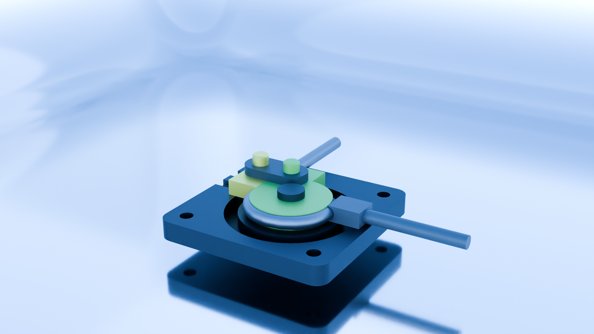

# Pipe Bending Machine
## Project Overview

This project is a learning-focused animation study created to understand and practice assembly animation workflows in Autodesk Inventor. The model represents a pipe bending mechanism, commonly used in manufacturing, and explores how constrained motion and deformation can be visualized and presented.

## Project Goals
- Learn assembly animation techniques in Autodesk Inventor
- Understand constraint-driven motion and sequencing
- Explore limitations of exporting Inventor animations

## Tools & Technologies
1. Autodesk Inventor
- Assembly constraints
- Motion sequencing

2. Blender
- Armature-based pipe deformation
- Material and rendering

## Preview

## Project Purpose

This project was created purely for learning and experimentation.
The focus was not on inventing a new mechanism, but on:

- Understanding animation systems in Inventor
- Learning how CAD animation translates (or doesn’t) to real-time environments

## License

This project is for educational and portfolio purposes.